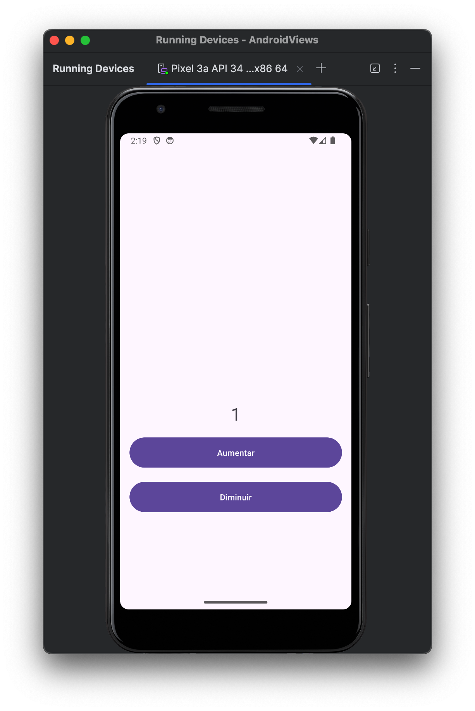

<h1 align="center">UpDown Control ⬆️⬇️ </h1>

## Project 🎯 

"UpDown Control" is a simple Android application that allows users to increase or decrease values with ease. The application features an intuitive interface, providing buttons to adjust values up or down smoothly. Ideal for scenarios requiring precise control, UpDown Control ensures a user-friendly experience by making adjustments as simple as a single tap.
## Layout 🎨 

<div align="center">
  <table style="border-collapse: collapse; margin: 10px;">
    <tr>
      <td style="padding: 10px; text-align: center;">
        
      </td>
      <td style="padding: 10px; text-align: center;">
        
      </td>
    </tr>
  </table>
</div>

<!-- 
<div align="center" style="display: flex; justify-content: center;">
  <div style="margin: 10px;">
    
  </div>
  <div style="margin: 10px;">
    
  </div>
</div>

<div align="center">
  
</div> -->

## Technologies Used 🤖🍏

- **Programming Language:** Kotlin
- **Development Environment:** Android Studio

## Code Author 💻👨‍💻

```kotlin
fun main() {
    println("Code by Júnio Moreira!")
    println("Welcome to the UpDown Control!")
}
